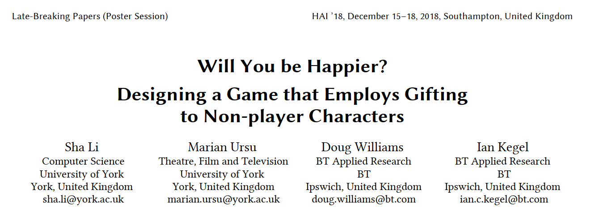
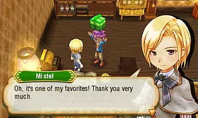

[//]: # (Paper Review  readme)

# Paper Review
#### Topics on Game Development VR/AR

This paper published at december 2018, I found it on SIGCHI (Special Interest Group on Computer-Human Interaction) 

## Paper Contents

### Intro

The act of giving a present can have a positive impact on the giver's mental well-being. This paper trying to find out if giving a present to video games non playable character (NPC) could give the same impact.

Gifting has been described as involving 3 stages :

- **Gestation** the entire process of gift transforming from a conceptual idea to the material item
- **Prestation** the actual gift exchange
- **Reformulation** repositioning of the relationship between the giver and recipient

There are 4 core element of gifting :

- **Giver**
- **Recipient**
- **Occasion**
- **Gift**

The interaction between them withint he gift-giving process that forms the uniqueness of a particular gift exchange.

**Why does gifting make people feel good?**
the act of giving enables the giver to feel more effective, valuable and generous.

Kindness and generousity can benefit happiness in many ways:
- First, people who give may develop their self-image as altruistic, empathic, socially responsible, agreeable, or influential, therefore, they feel more confident, effective, in control, and optimistic about their ability to help  
- Second, giving may generate a positive mood, ease guilt, reduce aversive arousal, or to fulfil a desire to show gratitude.
- Third, giving can satisfy human’s basic need for relatedness , contribute to peer acceptance as well as receiving appreciation, gratitude, and prosocial reciprocity(*mutual benefit*). Also increase senses of cooperation and interdependence.

> Altruism is the principle and moral practice of concern for happiness of other human beings and/or animals, resulting in a quality of life both material and spiritual

> Empathic means showing an ability to understand and share the feelings of another.

> In psychology, aversives are unpleasant stimuli that induce changes in behavior through punishment; by applying an aversive immediately following a behavior, the likelihood of the behavior occurring in the future is reduced.

### Game Design

In Author's design They intended players to: 
- Be aware of their selfimage.
- Be emotionally engaged. 
- Have a sense of social presence in the game 
- Have an awareness of the effective value of the gift. 

Author have created a game world where players are members of a social group and build social relationships with NPCs. When a gifting opportunity arises, players could gift to the NPCs without the expectation of a return or assuming a return which is unspecified during prestation. In addition, we aimed to make players understand time and money inside the game world, thus providing a context for analysing their decisions on gifts and the psychological outcomes of the gifting event.

Author designed a business simulation game with role-playing elements. They made a prototype (the Fairy game) capturing some original ideas which was useful as a foundation for comparison and iteratively develop another prototype (the Resident game). 
- Fairy version: Players do tasks e.g. watering and sell products with negotiated prices. A neighbour fairy cooperates with the players during the tasks and crisis. Gift-occasion is a thank-you gesture to the fairy’s help. Resident version: Players plan production and development and sell products with fixed prices. 
- A neighbour resident (‘Daniel’) who either gives the players bonus tokens or (‘Betty’) who talks about what happened. The gift-occasion is the resident’s birthday. 

The gifting process is similar in both games; players are free to gift or not and to choose a gift, a packaging and a way of delivery

Author invited 12 participants to playtest the game individually at different stages of development. The concept evaluated is consistent. Each participant played the two prototypes and was interviewed about their gaming experience and invited to compare the different design. The research purpose and the design objectives of the game were not revealed until a late stage of the interviews, after which the participants were asked to give their opinions on how the game could be improved

### Discussion

- **Time and Money**
Participants understood the business simulation part and it established their sense of time and money inside the game world. When given a set of gift options, participants could understand their value, such as “this dress is too cheap, I can make this much money by selling three bottles of milk”

- **Social relationship with NPC**
The fairy version received better effect as aimed than the resident version. Participants found the fairy was “very cute” and “helpful”, and “I see a friendship between me and the fairy”; 
They described the interaction as “engaging” and “interesting”. While some participants found Betty was “annoying”; they described the interaction as“interrupting”, some were going through the dialogues quickly without reading them. When the gifting event occurred, participants realised the fairy’s help and considered this in their decision to gift but were less able to recall the character in the resident version (e.g. “I don’t know who this Daniel/Betty is”).Fairy’s facial expressions and animations contributed to her popularity as well. Some participants said, “it would be nice to see the happiness level of the NPC”. We summarise that interacting with an NPC, whose emotions can be gauged by players, through cooperative events rather than conversations alone is more effective for building a close relationship with the NPC.

- **Motivation** Some participants wanted to gift or to gift well but did not do so because they “did not make good money before that” or “it was still early in the game, I wanted to save some money for later use”. Those who chose to gift or gifted well had different motivations too. Some participants said they regarded the NPC and the gifting event as “part of the game mechanism” that “gifting well will help me progress in the game”. Some gifted because “the NPC helped me” and some gave gifts because they “cared about the character”. One participant said that the reason she chose a teddy bear was because “it’s like a friendship type”.

- **Gifting process**The gifting process itself was well received by the participants. No one reported that the occurrence of the gifting event was out of place under either occasion. Those who noticed the NPC’s favourite colour during their conversations tended to choose the colour for the gift package. Most participants claimed that they were more conscious of making money after giving a gift to the NPC

## Paper Review

This paper explores gifting, which is a branch of an psychological aspect of game design which already existed in most games. 

**Empathy**

The ability to understand and share the feelings of another.

Games can evoke empathy in us. They can make us desire to be kind. They can help us put ourself in the shoes of others.

But they can also give us an easy way to tell ourselves that we are good people, that we always choose the good side, the light side, and always without making us do the work that being a good person actually requires.

In Darksouls, there's this one curious feature where you can see a blood stain of somewhere others died, and sometimes, when you realized you also died the same way before, you feel a tiny pang for the person who just went trough that same thing you understand he just lost progress and souls.

> [Example of blood stain](https://www.youtube.com/watch?v=JlWSwdY6mDM)

That is unmistakable moment of empathy experienced through a game, and I acted on it, deciding to leave a message to warn other player about the hazard, not for the reward it'll give me, but so that people, you've never met and will never meet won't have to suffer the same way you did.

> [Example of message](https://youtu.be/sVLvmk2ofVw?t=58)

That is kind of incredible when you think about it, it's part of what makes dark souls such a communal experience, even if you play the whole thing by yourself. but most game don't do nearly as well

We all had a moment where a game asked us to save a planet, rescue a cat, help villagers slay a dangerous monster, and the game tell us that these are good acts, and we are good people for doing them. We are even often given a goodness stat (*reputation, affection points, etc*), so that we know just how good we were for helping out. The problem though, is that we really weren't.

Empathetic acts fundamentally about doing something for someone other than yourself. but in so many games where you have your heroic moments. That moment is really about you, not about whomever you're helping.

So many games are so focused on empowering the player that many times, acting good in a game  ends up being about that too. But in truth, helping somebody isn't really the goal. The reward for helping somebody is the goal. Maybe it's some bonus the game give you or the praise you receive from characters in the game.

And even in the cases where games actually ask something of you to do the good thing. It's often negligible or something you'd want to do anyway. It's not actually a sacrifice. Helping them is easy and meaningless. You're not actually empathizing with a group you're helping because you never have to consider the cost to yourself.

The question of 
- Should I help these people ?
- Can I afford to help these people ?

Isn't something the game even makes you think about, half of the time, we're really only doing any of these good things because we figure it's what the game wants us to do, the plot and objectives.

For this, I want to give an example. My absolute favorite game of all times. At The Game Awards 2017, the game won the award for "Best Score/Music" and was nominated for "Best Narrative" and "Best Role-Playing Game".

Nier Automata is an action role-playing game developed by PlatinumGames and published by Square Enix. The game was released for the PlayStation 4 and Microsoft Windows in early 2017.

I don't think I'm able to explain the plot of the game, so I leave it to the experts to do so.

[First few seconds of the game, 0:00 - 0.23](https://www.youtube.com/watch?v=4MU0yMgu3bQ)

[An overall plot review, 3:02 - 7:15](https://youtu.be/_yfA94EpeqM?t=182Q)

[Nier Automata True Ending, 34:34 - 39:48](https://youtu.be/63PzQIbTrM8?t=2074)

It cost you everything you've worked for in this game, the hundred of hours you've invested, all the items you found, all the levels you gained, all the side quest and parts of the story you never saw, you won't get a chance to finish them unless you start the game over.

This is a real sacrifice, giving up something you love, giving up the story you created, the hours you put in to build in it. just so, some day, somebody you'll never meet will have an easier time. I chose to do it. Because I know what those other people will be going through, their frustation is something you can relate to, you know exactly what other people already gave up to help you. That is a powerful moment, a true empathetic moment.

Because kindness in our world usually asks something of us, something that's hard to give. And it's a worthy thing for a game to remind us that we're not good for simply doing good things, when it costs us nothing. That sacrificing something is where true kindness happens. 

>  [Source of most of the script](https://www.youtube.com/watch?v=rxC0iIdkO6o)
